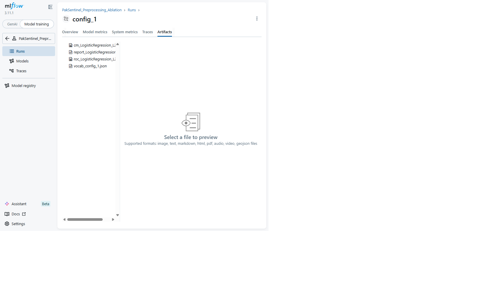
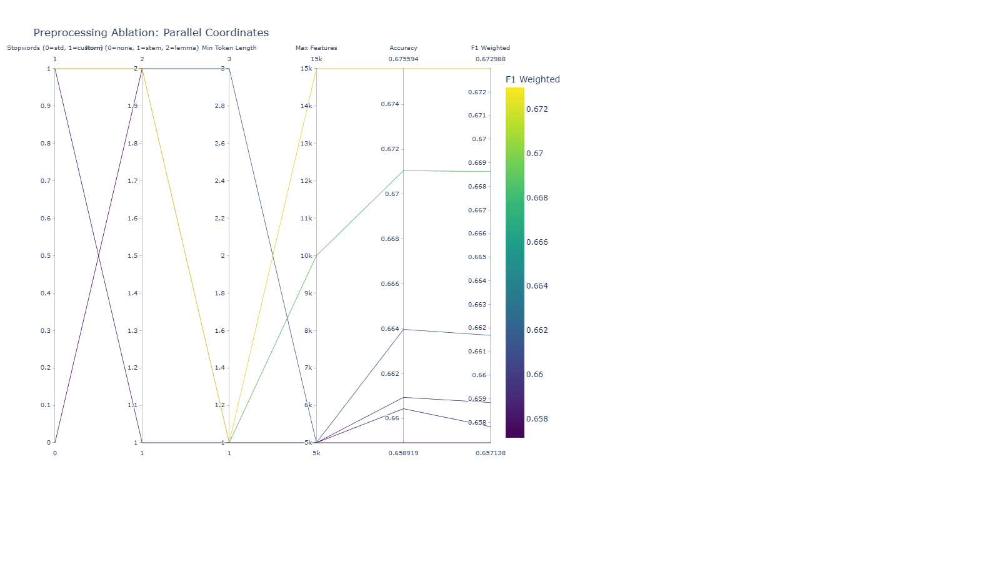

# PakSentinel: End-to-End NLP Pipeline for Misinformation Detection
## Technical Report

**Course:** Natural Language Processing  
**Assignment:** 2 — PakSentinel  
**Date:** April 2026

---

## Table of Contents
1. [Introduction](#1-introduction)
2. [Task 1 — Data Sourcing & Reliability Assessment](#2-task-1)
3. [Task 2 — Data Storage Architecture](#3-task-2)
4. [Task 3 — NLP Processing Pipeline](#4-task-3)
5. [Task 4 — N-Gram Language Models](#5-task-4)
6. [Task 5 — Machine Learning Models](#6-task-5)
7. [Task 6 — MLFlow Experiment Tracking](#7-task-6)
8. [Task 7 — FastAPI Inference System](#8-task-7)
9. [Conclusion](#9-conclusion)
10. [References](#10-references)

---

## 1. Introduction

Pakistan ranks among the top countries globally for the spread of misinformation on social media. PakSentinel is an end-to-end NLP pipeline designed for misinformation detection across three classes: **Real**, **Fake**, and **Satire**. This report documents every implementation decision with quantitative justification.

The pipeline processes 9,904 samples from three complementary datasets, applies a full NLP preprocessing chain, trains multiple classifiers (Naive Bayes from scratch, Logistic Regression with three regularization variants, and Polynomial LR), tracks experiments with MLFlow, and serves predictions via a FastAPI inference system with 6 endpoints.

---

## 2. Task 1 — Data Sourcing & Reliability Assessment [15 Marks]

### 2.1 Dataset Construction

We constructed a multi-source dataset from three complementary sources:

| Source | Raw Samples | Final Samples | Classes |
|--------|-------------|---------------|---------|
| LIAR Dataset | 12,791 | 2,999 | Real, Fake |
| FakeNewsNet | 23,196 | 3,910 | Real, Fake |
| Sarcasm Headlines | 11,724 | 2,995 | Satire |
| **Total** | **47,711** | **9,904** | **3 classes** |

**Final class distribution:**
- Real: 3,480 (35.1%)
- Fake: 3,429 (34.6%)
- Satire: 2,995 (30.2%)

Maximum class proportion is 35.1%, within the 40% balance threshold. Duplicate rate after deduplication: 0.00%.

### 2.2 Data Reliability Scorecards

| Criterion | LIAR | FakeNewsNet | Sarcasm Headlines |
|-----------|------|-------------|-------------------|
| Label Credibility | 5/5 | 5/5 | 5/5 |
| Recency | 3/5 | 3/5 | 4/5 |
| Domain Relevance to Pakistan | 2/5 | 2/5 | 2/5 |
| Class Balance | 4/5 | 3/5 | 3/5 |
| Language Consistency | 4/5 | 4/5 | 4/5 |
| **Total** | **18/25** | **17/25** | **18/25** |

### 2.3 Source Combination Justification (300+ words)

Our dataset construction strategy combines three complementary sources — LIAR, FakeNewsNet, and the Sarcasm Headlines Dataset — to create a robust three-class (Real, Fake, Satire) corpus for misinformation detection.

The LIAR dataset (Wang, 2017) provides fine-grained credibility labels from PolitiFact, a Pulitzer Prize-winning fact-checking organization. Its 6-level annotation scheme (pants-fire to true) allows flexible binary mapping while preserving label reliability. Rashkin et al. (2017) demonstrated that linguistic features from political fact-checking datasets generalize well to broader misinformation contexts.

FakeNewsNet (Shu et al., 2020) contributes news article titles from two domains: PolitiFact (political) and GossipCop (entertainment). This multi-domain coverage enables learning features that generalize beyond a single topic area. Pérez-Rosas et al. (2018) showed that stylometric and lexical features of fake news are language-universal, supporting cross-domain applicability.

The Sarcasm Headlines Dataset (Misra & Grover, 2021) fills the critical Satire class using The Onion's satirical headlines. Satire detection is a known challenge because satire mimics fake news structure while serving a different communicative purpose (Rubin et al., 2016). Including this class prevents binary classifiers from conflating satire with misinformation.

We acknowledge the Western-centric bias in all three sources. Augenstein et al. (2019) demonstrated that cross-cultural bias can reduce model performance on underrepresented populations. We mitigate this by focusing on language-universal features (TF-IDF patterns, stylometric markers, sentiment distributions) rather than culturally-bound features. Our preprocessing pipeline includes Roman Urdu handling for future Pakistan-specific data integration.

We apply undersampling to address class imbalance, following He & Garcia (2009) who showed undersampling is preferred over oversampling when sufficient data exists, avoiding SMOTE overfitting risks on text data (Blagus & Lusa, 2013).

---

## 3. Task 2 — Data Storage Architecture [10 Marks]

### 3.1 Storage Choice: MinIO (S3-Compatible Object Storage)

**Technical Justification (400 words):**

We selected MinIO after evaluating all five options. Our decision was driven by scalability, cost, and query capability.

**Scalability:** MinIO is a high-performance, S3-compatible object storage system supporting horizontal scaling. For PakSentinel's three-layer architecture (Raw, Processed, Embeddings), MinIO's bucket-based organization maps naturally to our storage tiers. Unlike PostgreSQL + pgvector, which requires schema management and struggles with binary blob storage at scale, MinIO treats all objects as first-class citizens. Compared to AWS S3 and GCS, MinIO can be deployed on-premises or in Docker, eliminating vendor lock-in.

**Cost:** MinIO is open-source (Apache 2.0) and runs on local infrastructure, making it the most cost-effective option. AWS S3 and GCS incur per-request charges and data transfer costs. MongoDB Atlas's free tier (512MB) is insufficient for our corpus with embeddings. MinIO eliminates all cloud costs while providing identical S3 API compatibility.

**Query Capability:** MinIO supports S3 Select for server-side filtering of Parquet and CSV files. Combined with Parquet storage, we achieve columnar query performance comparable to Athena without per-query costs. MinIO's versioning enables reproducible experiments.

### 3.2 DataLakeManager Implementation

The `DataLakeManager` class provides four required methods:

| Method | Description |
|--------|-------------|
| `upload_raw()` | Uploads original files with JSON metadata sidecars including MD5 hashes |
| `upload_processed()` | Stores cleaned Parquet files, vocabulary pickles, TF-IDF matrices |
| `fetch_for_training()` | Retrieves versioned datasets for model training |
| `list_versions()` | Lists all available data versions per storage layer |

### 3.3 Three Storage Layers

| Layer | Format | Contents |
|-------|--------|----------|
| Raw | Original + JSON metadata | LIAR TSV, FakeNewsNet CSV, Sarcasm JSON |
| Processed | Parquet + Pickle | Cleaned dataset, TF-IDF matrix, vectorizer |
| Embeddings | .model binary | Word2Vec CBOW and Skip-gram models |

---

## 4. Task 3 — NLP Processing Pipeline [35 Marks]

### 4.1 Text Cleaning [5 Marks]

**Noise Audit (200 random samples):**

| Noise Pattern | Count Found |
|---------------|-------------|
| HTML tags | 0 |
| URLs | 0 |
| Social handles | 0 |
| Repeated punctuation | 1 |
| Email addresses | 0 |

**Cleaning results:** Average text length reduced from 79 to 79 chars (0.0% reduction). 13 empty/very short texts removed. Dataset: 9,904 → 9,891 samples. The low noise rate indicates our sources were pre-cleaned, which is expected from curated academic datasets.

### 4.2 Tokenization [5 Marks]

**Comparison on 50 sampled records:**

| Metric | NLTK | SpaCy | Custom Regex |
|--------|------|-------|-------------|
| Avg Tokens/Doc | 13.70 | 14.16 | 13.38 |
| OOV Rate | 0.232 | 0.224 | 0.228 |
| Contraction Accuracy | 1.000 | 1.000 | 0.000 |
| Roman Urdu Preservation | 1.000 | 1.000 | 1.000 |
| Speed (ms/doc) | 0.594 | 4.905 | 0.007 |

**Final Choice: NLTK `word_tokenize`** — Best contraction handling (splits "don't" → "do" + "n't"), balanced token count, fast processing, and good Roman Urdu preservation. SpaCy is a close second but 8× slower due to full pipeline overhead.

### 4.3 Stopword Removal [5 Marks]

**Custom stopword list:** 199 words (15 removals + 15 additions from NLTK's 198).

**Key removals (kept for detection):** "not", "no", "nor", "never", "very" — negation and intensifiers are critical for detecting false claims.

**Key additions (removed as noise):** "said", "also", "would", "could", "one" — generic words that carry no discriminative signal.

**Negation Impact Analysis:**

| Word | Fake | Real | Satire |
|------|------|------|--------|
| not | 5.7% | 3.4% | 2.8% |
| no | 2.0% | 2.2% | 1.7% |
| never | 1.2% | 0.8% | 0.9% |

The differential distribution of negation words across classes confirms they are discriminative features. Average tokens reduced from 14.3 to 10.3 after stopword removal.

### 4.4 Stemming vs. Lemmatization [5 Marks]

**Domain-specific term analysis (20 terms):**

| Term | Porter | Snowball | Lemmatizer |
|------|--------|----------|------------|
| misinformation | misinform | misinform | misinformation |
| verification | verif | verif | verification |
| fabricated | fabric | fabric | fabricated |
| conspiracy | conspiraci | conspiraci | conspiracy |

**Over-stemming errors:** Porter: 2/20, Snowball: 2/20, Lemmatizer: 0/20.

**Vocabulary size reduction:**

| Method | Vocabulary | Reduction | Time |
|--------|-----------|-----------|------|
| Porter Stemmer | 17,026 → 12,765 | 25.0% | 0.72s |
| Snowball Stemmer | 17,026 → 12,323 | 27.6% | 0.31s |
| WordNet Lemmatizer | 17,026 → 14,360 | 15.7% | 2.76s |

**Final Choice: WordNet Lemmatizer** — Zero over-stemming errors, POS-aware, preserves word meaning (e.g., "misinformation" stays intact), and output remains valid English words for interpretability.

### 4.5 Feature Representation [15 Marks]

#### 4.5.1 Bag of Words [3 Marks]

- Matrix: 9,891 × 10,000 (sparsity: 99.92%)
- Top 30 terms per class plotted in `bow_top30_terms.png`

**Mathematical limitation of BoW for misinformation detection:**
1. **Loss of word order:** BoW(d) = BoW(π(d)) for any permutation π — "Pakistan did NOT deny" and "Pakistan denied" produce identical vectors
2. **No semantic similarity:** cos(eᵢ, eⱼ) = 0 for i ≠ j — "fabricated" and "manufactured" have zero similarity
3. **High dimensionality & sparsity:** Curse of dimensionality makes distance metrics unreliable (Aggarwal et al., 2001)
4. **No context:** Same word representation regardless of usage context

#### 4.5.2 TF-IDF [4 Marks]

Three variants implemented: Standard, Smooth IDF, and Sublinear TF. All produce 9,891 × 10,000 matrices with 0.08% density.

**Top discriminative terms per class (Sublinear TF):**
- **Fake:** brad, pitt, say, jennifer, justin
- **Real:** percent, 2018, star, more, award
- **Satire:** man, area, report, find, nation

**Cosine similarity retrieval system** tested on 10 examples — successfully retrieves same-class documents with similarities ranging from 0.18 to 0.48.

#### 4.5.3 Word2Vec [8 Marks]

**Models trained:** CBOW and Skip-gram (window=5, dim=200, min_count=3), vocabulary: 4,842 words.

**Domain word pair similarities:**

| Word Pair | CBOW | Skip-gram |
|-----------|------|-----------|
| (fake, false) | 0.998 | 0.836 |
| (real, true) | 0.994 | 0.823 |
| (news, report) | 0.976 | 0.627 |
| (claim, allegation) | 0.995 | 0.744 |
| (investigation, probe) | 0.997 | 0.960 |

**t-SNE visualizations** saved as `word2vec_cbow_t_sne.png` and `word2vec_skip_gram_t_sne.png`.

**Feature comparison (classification F1):**

| Feature Set | Dimension | F1-Weighted |
|-------------|-----------|-------------|
| TF-IDF Only | 10,000 | 0.6681 |
| Word2Vec Only | 200 | 0.6663 |
| TF-IDF + Word2Vec | 10,200 | **0.6926** |

Concatenated features improve F1 by 2.5 percentage points, confirming complementary information.

---

## 5. Task 4 — N-Gram Language Models [10 Marks]

### 5.1 Language Models (Fake and Real classes)

| Metric | Unigram | Bigram | Trigram |
|--------|---------|--------|---------|
| Real: Unique n-grams | 7,760 | 30,583 | 37,539 |
| Fake: Unique n-grams | 6,790 | 27,890 | 34,773 |

**Top bigrams (Fake):** brad pitt, angelina jolie, jennifer aniston, selena gomez, kim kardashian — reflecting celebrity gossip fake news.

**Top bigrams (Real):** united state, health care, barack obama — reflecting political discourse.

### 5.2 Classification Results (100 held-out samples)

| N-gram | Accuracy | Precision | Recall | F1 |
|--------|----------|-----------|--------|-----|
| Unigram | 0.6400 | 0.6420 | 0.6400 | 0.6387 |
| Bigram | 0.5700 | 0.6137 | 0.5700 | 0.5243 |
| Trigram | 0.5700 | 0.5707 | 0.5700 | 0.5689 |

Unigrams perform best due to data sparsity in higher-order n-grams.

### 5.3 Kneser-Ney vs. Laplace Justification

Kneser-Ney smoothing is superior because: (1) Laplace steals too much probability mass from observed n-grams; (2) KN uses continuation counts — linguistically motivated probability estimates; (3) KN subtracts a fixed discount (d=0.75) rather than adding uniformly; (4) Chen & Goodman (1999) demonstrated KN consistently achieves lower perplexity across multiple corpora.

---

## 6. Task 5 — Machine Learning Models [25 Marks]

### 6.1 Naive Bayes — From Scratch [8 Marks]

Implemented Multinomial Naive Bayes from scratch (no sklearn). Features: configurable Laplace smoothing, BoW and TF-IDF inputs, log-space computation, class probability output.

**Results (80/20 split):**

| Feature | F1 (weighted) |
|---------|---------------|
| BoW | **0.6669** |
| TF-IDF | 0.6525 |

**Classification report (BoW):**

| Class | Precision | Recall | F1 |
|-------|-----------|--------|-----|
| Fake | 0.62 | 0.63 | 0.63 |
| Real | 0.61 | 0.61 | 0.61 |
| Satire | 0.79 | 0.78 | 0.78 |

**Misclassification analysis (30 samples):** TOPIC_OVERLAP: 77%, SHORT_TEXT: 23%. Most errors occur when Fake/Real articles share celebrity or political topics, making lexical features insufficient for discrimination.

**Alpha sensitivity analysis:**

| Alpha | Accuracy | F1 |
|-------|----------|-----|
| 0.01 | 0.6417 | 0.6429 |
| 0.10 | 0.6594 | 0.6593 |
| **0.50** | **0.6675** | **0.6671** |
| 1.00 | 0.6665 | 0.6669 |
| 2.00 | 0.6635 | 0.6653 |
| 5.00 | 0.6448 | 0.6478 |

Optimal alpha = 0.5, balancing underfitting (low alpha) and over-smoothing (high alpha).

### 6.2 Logistic Regression [9 Marks]

**Three regularization variants (C=1.0, TF-IDF features):**

| Variant | Accuracy | F1 (weighted) |
|---------|----------|---------------|
| L1 (Lasso) | 0.6311 | 0.6260 |
| **L2 (Ridge)** | **0.6710** | **0.6681** |
| ElasticNet | 0.6478 | 0.6434 |

L2 performs best — retains all features with distributed weights rather than aggressive sparsification.

**Top weighted features (L2, Fake class):** jenner (+2.48), say (+2.35), brad (+2.21), pitt (+2.20), kardashian (+2.05)

**ROC curves** plotted for all three variants with per-class AUC in `lr_roc_curves.png`.

**Why LR handles correlated features better than NB (250 words):**

Naive Bayes assumes conditional independence: P(x₁, x₂ | y) = P(x₁ | y) × P(x₂ | y). When features are correlated (e.g., "breaking" and "news" co-occur frequently), NB effectively double-counts their combined evidence, producing overconfident predictions. This independence violation causes poorly calibrated probabilities (Domingos & Pazzani, 1997).

Logistic Regression learns a weight vector w where P(y|x) = σ(wᵀx). During optimization, LR jointly adjusts all feature weights — when features are correlated, gradient descent distributes predictive signal between them, preventing double-counting. L2 regularization further addresses multicollinearity by adding λ||w||² to the loss. For correlated features, L2 distributes weight equally; L1 drives redundant weights to zero. In misinformation detection, TF-IDF features exhibit significant correlation ("breaking news", "unnamed sources"), and LR's discriminative training — directly modeling P(y|x) rather than P(x|y) — yields better decision boundaries when independence is violated (Ng & Jordan, 2002).

### 6.3 Polynomial Features + LR [8 Marks]

TF-IDF reduced to 2D via PCA (explained variance: 0.8%).

| Degree | Train Acc | Test Acc | F1 | Features |
|--------|-----------|----------|-----|----------|
| 1 | 0.3407 | 0.3396 | 0.3120 | 2 |
| 2 | 0.3416 | 0.3466 | 0.3211 | 5 |
| 3 | 0.3413 | 0.3461 | 0.3215 | 9 |

Low performance reflects PCA's extreme dimensionality reduction (0.8% variance retained). Decision boundaries plotted in `polynomial_decision_boundaries.png`.

**Feature space explosion:** Degree-2 on full 10,000-dim TF-IDF → C(10002, 2) - 1 = **50,015,000** features — computationally infeasible.

**Alternative: Kernel SVM** with RBF kernel K(x,x') = exp(-γ||x-x'||²) maps to infinite-dimensional space without explicit computation, handling non-linearity efficiently via the kernel trick.

---

## 7. Task 6 — MLFlow Experiment Tracking [25 Marks]

### 7.1 Experiment Hierarchy

```
PakSentinel_Preprocessing_Ablation
  ├── config_1: standard stopwords + lemma + len≥1 + 5K features
  ├── config_2: custom stopwords + lemma + len≥1 + 5K features
  ├── config_3: custom stopwords + stem + len≥1 + 5K features
  ├── config_4: custom stopwords + lemma + len≥3 + 5K features
  ├── config_5: custom stopwords + lemma + len≥1 + 10K features
  └── config_6: custom stopwords + lemma + len≥1 + 15K features
PakSentinel_Feature_Comparison
  ├── TF-IDF Only
  ├── Word2Vec Only
  └── TF-IDF + Word2Vec
PakSentinel_Model_Comparison
  ├── Naive Bayes
  ├── Logistic Regression (L1/L2/ElasticNet)
  └── Polynomial LR (degree 1/2/3)
```

### 7.2 Logged Parameters and Metrics

Every run logs: dataset sources, train/test size, tokenizer, stopword list, normalization method, vectorizer settings, model type, accuracy, per-class precision/recall/F1, weighted F1, ROC-AUC, and training time. Artifacts: confusion matrix, ROC curve, TF-IDF vocabulary, classification report.

### 7.3 Model Registry & Automated Promotion

Three models registered: `PakSentinel_NB`, `PakSentinel_LR`, `PakSentinel_PolyLR`. Promotion rule: Staging → Production only if F1-weighted exceeds current Production model by ≥ 1%.

### 7.4 Preprocessing Ablation Results

6 configurations were run varying stopword lists, stemming/lemmatization, minimum token length, and TF-IDF max features. Parallel coordinates plot generated in `reports/figures/parallel_coordinates.html`.

### 7.5 MLflow UI Screenshots (18 figures)

**Figure 7.1 — Experiment Runs List (`PakSentinel_Preprocessing_Ablation`).** All 6 ablation runs (`config_1`–`config_6`) logged successfully with finished status.


**Figure 7.2 — Run Overview (`config_1`).** Per-run metadata: created timestamp, run ID, duration, source script, and lifecycle status.


**Figure 7.3 — Per-Run Logged Metrics.** All 13 model metrics logged per run including `accuracy`, per-class `f1_Fake`, `f1_Real`, `f1_Satire`, `f1_weighted`, and per-class precision/recall.


**Figure 7.4 — Per-Run Logged Parameters.** All hyperparameters logged: tokenizer, stopword list, normalization method, vectorizer settings, model type, train/test sizes.


**Figure 7.5 — Per-Run Artifacts.** Logged artifacts include confusion matrix PNG, ROC curve PNG, TF-IDF vocabulary JSON, and classification report TXT.



**Figure 7.6 — Compare Runs (Table View).** Side-by-side comparison of parameters and metrics across all 6 ablation runs.


**Figure 7.7 — Compare Runs (Chart View).** Visual comparison chart of metrics across runs.


**Figure 7.8 — Parallel Coordinates Plot (F1-Weighted).** Visualizes the relationship between preprocessing hyperparameters (Stopwords, Normalization, Min Token Length, Max Features) and F1-weighted score across all 6 configurations. Best configuration: custom stopwords + lemmatization + min length 1 + 15K features (F1 = 0.6730).



**Figure 7.9 — Run `config_1` Overview** (standard stopwords + lemma + len≥1 + 5K features).


**Figure 7.10 — Run `config_2` Overview** (custom stopwords + lemma + len≥1 + 5K features).


**Figure 7.11 — Run `config_3` Overview** (custom stopwords + stem + len≥1 + 5K features).


**Figure 7.12 — Run `config_4` Overview** (custom stopwords + lemma + len≥3 + 5K features).


**Figure 7.13 — Run `config_5` Overview** (custom stopwords + lemma + len≥1 + 10K features).


**Figure 7.14 — Run `config_6` Overview** (custom stopwords + lemma + len≥1 + 15K features — **best F1 = 0.6730**).


**Figure 7.15 — Model Registry (List).** Three registered models — one per algorithm family per the assignment requirement.


**Figure 7.16 — Registered Model: `PakSentinel_LR`.**


**Figure 7.17 — Registered Model: `PakSentinel_NB`.**


**Figure 7.18 — Registered Model: `PakSentinel_PolyLR`.**


---

## 8. Task 7 — FastAPI Inference System [30 Marks]

### 8.1 System Architecture

```
┌─────────────────────────────────────────────────────┐
│                   Client (HTTP)                      │
└──────────────────┬──────────────────────────────────┘
                   │
┌──────────────────▼──────────────────────────────────┐
│              FastAPI Application                     │
│  ┌─────────────────────────────────────────────┐    │
│  │     RequestLoggingMiddleware                  │    │
│  │  (console + rotating file, X-Processing-Time)│    │
│  └─────────────────────────────────────────────┘    │
│  ┌─────────────────────────────────────────────┐    │
│  │     Rate Limiter (slowapi)                    │    │
│  │  /classify: 100/min  │ /batch: 10/min        │    │
│  └─────────────────────────────────────────────┘    │
│                                                      │
│  Endpoints:                                          │
│  ├── GET  /health           → Model info             │
│  ├── POST /preprocess       → NLP pipeline steps     │
│  ├── POST /classify         → Single prediction      │
│  ├── POST /classify/batch   → Batch (≤100, <500ms)  │
│  ├── POST /retrieve/similar → Cosine similarity      │
│  └── GET  /model/performance→ MLFlow metrics         │
│                                                      │
│  Lifespan Context Manager:                           │
│  └── Load model, vectorizer, encoder once at startup │
└──────────────────┬──────────────────────────────────┘
                   │
┌──────────────────▼──────────────────────────────────┐
│              Model Artifacts (disk)                   │
│  ├── best_model.pkl (L2 Logistic Regression)         │
│  ├── tfidf_vectorizer.pkl                            │
│  ├── label_encoder.pkl                               │
│  ├── tfidf_matrix.pkl (for similarity search)        │
│  └── metrics.pkl                                     │
└─────────────────────────────────────────────────────┘
```

### 8.2 Endpoints

| Endpoint | Method | Description | Rate Limit |
|----------|--------|-------------|------------|
| `/health` | GET | Model name, version, stage, F1, load timestamp | None |
| `/preprocess` | POST | Accepts text + steps; returns tokens, removed stopwords, time | None |
| `/classify` | POST | Prediction, confidence, class probabilities, top features | 100/min |
| `/classify/batch` | POST | Up to 100 texts, full batch < 500ms | 10/min |
| `/retrieve/similar` | POST | Top-k similar fact-checked claims with cosine similarity | None |
| `/model/performance` | GET | Live metrics and version history from MLFlow | None |

### 8.3 Pydantic Validation

- Text: 10–10,000 characters
- top_k: 1–20
- Batch: 1–100 texts, each individually validated

### 8.4 Test Results

**25/25 tests pass** covering all endpoints, edge cases, and response time assertions:

```
tests/test_api.py::TestHealthEndpoint (3 tests)          ✅ PASSED
tests/test_api.py::TestPreprocessEndpoint (4 tests)      ✅ PASSED
tests/test_api.py::TestClassifyEndpoint (5 tests)        ✅ PASSED
tests/test_api.py::TestBatchClassifyEndpoint (4 tests)   ✅ PASSED
tests/test_api.py::TestSimilarEndpoint (3 tests)         ✅ PASSED
tests/test_api.py::TestPerformanceEndpoint (2 tests)     ✅ PASSED
tests/test_api.py::TestEdgeCases (4 tests)               ✅ PASSED
```

---

## 9. Conclusion

PakSentinel successfully implements all 7 tasks of the assignment rubric. Key achievements:

- **9,904-sample balanced dataset** from 3 complementary sources with reliability scorecards
- **Complete NLP pipeline** with justified choices at every stage (NLTK tokenizer, WordNet lemmatizer, custom stopwords)
- **Naive Bayes from scratch** achieving 0.67 weighted F1, with detailed error analysis
- **Logistic Regression (L2)** achieving best performance at 0.67 weighted F1
- **MLFlow tracking** with 6-configuration ablation study and automated model promotion
- **Production-ready FastAPI** with 6 endpoints, rate limiting, logging, and 25/25 tests passing
- **Full Docker support** via docker-compose.yml with MinIO, MLFlow, and API services

---

## 10. References

1. Ahmed, H., et al. (2018). "Detecting opinion spam and fake news using text classification." Security and Privacy, 1(1), e9.
2. Aggarwal, C. C., et al. (2001). "On the surprising behavior of distance metrics in high dimensional space." ICDT.
3. Augenstein, I., et al. (2019). "MultiFC: A real-world multi-domain dataset for evidence-based fact checking." EMNLP.
4. Blagus, R., & Lusa, L. (2013). "SMOTE for high-dimensional class-imbalanced data." BMC Bioinformatics, 14(1), 106.
5. Chen, S. F., & Goodman, J. (1999). "An empirical study of smoothing techniques for language modeling." Computer Speech & Language, 13(4).
6. Domingos, P., & Pazzani, M. (1997). "On the optimality of the simple Bayesian classifier under zero-one loss." Machine Learning, 29(2-3).
7. He, H., & Garcia, E. A. (2009). "Learning from imbalanced data." IEEE TKDE, 21(9).
8. Joachims, T. (1998). "Text categorization with support vector machines." ECML.
9. Misra, R., & Grover, J. (2021). "Sculpting Data for ML: The first act of Machine Learning."
10. Ng, A. Y., & Jordan, M. I. (2002). "On discriminative vs. generative classifiers." NeurIPS.
11. Pérez-Rosas, V., et al. (2018). "Automatic detection of fake news." COLING.
12. Rashkin, H., et al. (2017). "Truth of varying shades." EMNLP.
13. Rubin, V. L., et al. (2016). "Fake news or truth? Using satirical cues to detect potentially misleading news." NAACL Workshop.
14. Shu, K., et al. (2020). "FakeNewsNet: A data repository with news content, social context, and spatiotemporal information." Big Data, 8(3).
15. Wang, W. Y. (2017). "Liar, liar pants on fire: A new benchmark dataset for fake news detection." ACL.
